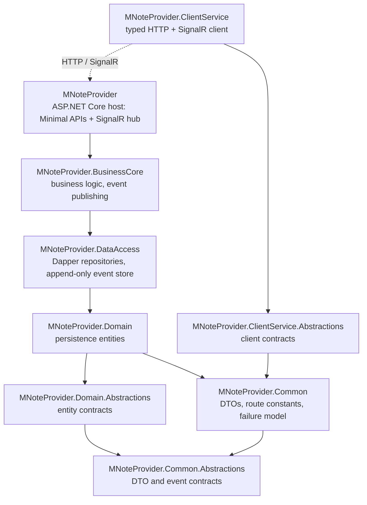

# MNotes

A self-hosted note-taking backend built on .NET 10 and PostgreSQL, with notes organized in
hierarchical folders, tags, comments, a per-note change history backed by an
append-only event stream, and real-time change notifications over SignalR.

> **Status: Work in progress.** This project currently consists of the backend only: a REST API,
> a real-time hub, and a typed .NET client library. There is **no frontend yet**; a client UI
> consuming `MNoteProvider.ClientService` is the next milestone. 

> **⚠️ Security Warning**
> 
> Authentication and authorization are **not implemented yet**. The MNotes provider currently has 
> **no production-ready authentication and authorization boundary**. 
> 
> **Do not expose it to untrusted networks or the public internet.** 
> 
> - HTTP endpoints and SignalR hub are directly accessible without authentication
> - The current version is intended for **local development only** or use in a **fully trusted environment**

## Architecture

Strictly layered; dependencies point in one direction only. Contracts live in separate
`*.Abstractions` assemblies, so the compiler, rather than convention, enforces the dependency rule.



Design decisions worth noting:

- **Ports & adapters for events:** The business layer publishes through its own
  `INoteEventPublisher` port; the SignalR adapter is injected at the composition root.
  Business logic has no transport dependency and is testable in isolation.
- **Errors as values:** Operations return `OneOf<TResult, MNoteProcessFail>` instead of
  throwing for expected failures, so every caller must handle both outcomes explicitly.
- **Append-only event stream:** Note updates are recorded as immutable events with a type
  discriminator, providing per-note history; deleting a note soft-deactivates its events
  instead of destroying the audit trail.
- **Server and client share route constants** (`MNotesRoutes`), reducing duplicated
  route strings and the risk of route drift between the API and the typed client.
- The database schema ([db/schema.sql](db/schema.sql)) documents the rationale behind every
  structural decision in inline comments.

## Dependencies

| Package | Used in | Purpose |
|---|---|---|
| [Dapper](https://github.com/DapperLib/Dapper) | DataAccess | Micro-ORM; SQL stays explicit and under full control |
| [Npgsql](https://www.npgsql.org/) | DataAccess | PostgreSQL ADO.NET driver |
| [OneOf](https://github.com/mcintyre321/OneOf) | all layers | Discriminated unions for explicit success/failure results |
| ASP.NET Core SignalR (+ client) | Host, ClientService | Real-time note change notifications |
| `Microsoft.Extensions.*` | Common, DataAccess, ClientService | Configuration, DI, and HTTP client factory abstractions |
| NUnit, FluentAssertions, coverlet | tests | Test framework, assertions, coverage |

No further runtime dependencies—the goal is a small, fully explainable dependency graph.

## Getting started

Requirements: the [.NET 10 SDK](https://dotnet.microsoft.com/download) and PostgreSQL 14+.

```bash
# 1. Create and initialize the database (idempotent; reset.sql wipes it first if needed)
createdb mnotes
psql -d mnotes -f db/schema.sql

# 2. Configure the database connection
#    Override Settings:DBConnection from src/MNoteProvider/appsettings.json
#    in a git-ignored appsettings.Development.json (or through environment variables).

# 3. Run the API (listens on https://localhost:6015)
dotnet run --project src/MNoteProvider
```

The API exposes endpoints for notes, folders, tags, comments, and note-tag
assignments, plus note history (`/note/gethistory`, `/note/loadpreviousversion`).
Clients receive `NoteCreated` / `NoteUpdated` / `NoteDeleted` events in real time via the
SignalR hub at `/hubs`.

## Tests

```bash
dotnet test
```

Unit tests run without a live database; coverage is still growing.

## Roadmap

- Web frontend consuming the client library
- Broader test coverage (business layer, API integration tests)
- Authentication and authorization (API + SignalR protection)
- Persist note updates and their history events atomically in a shared database transaction
- Store create and delete events in the event stream (currently updates only)
- Add global exception handling for consistent API error responses

## License

[MIT](LICENSE.txt)
